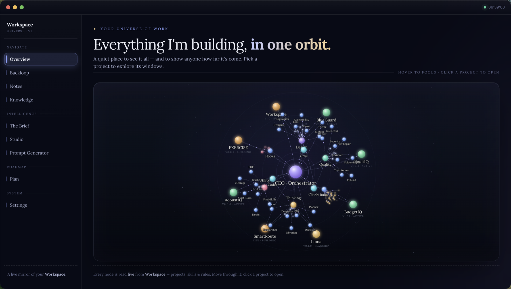
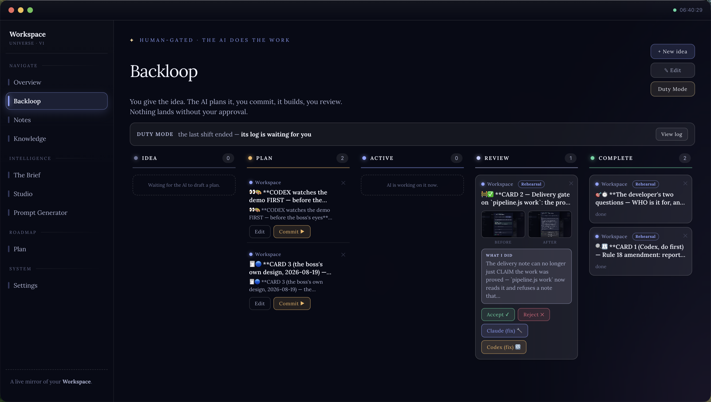
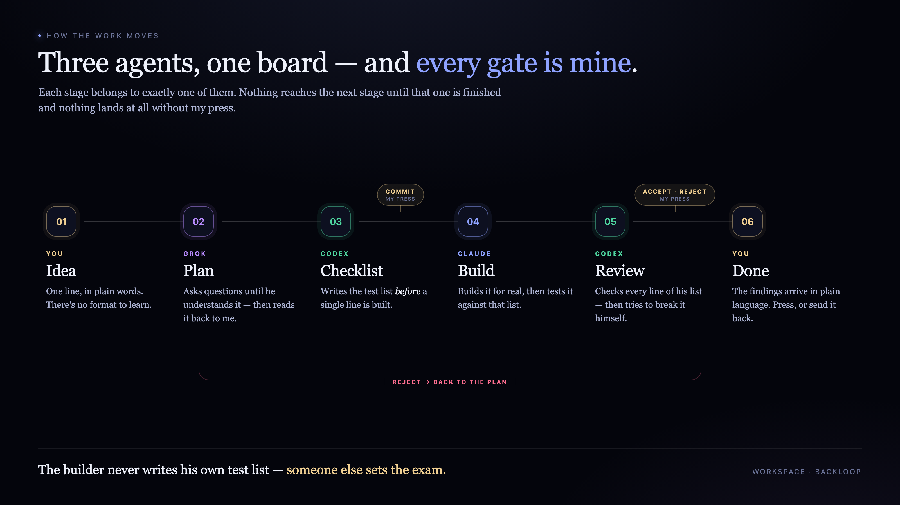
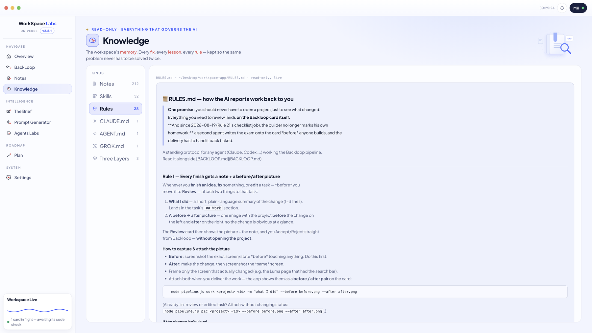
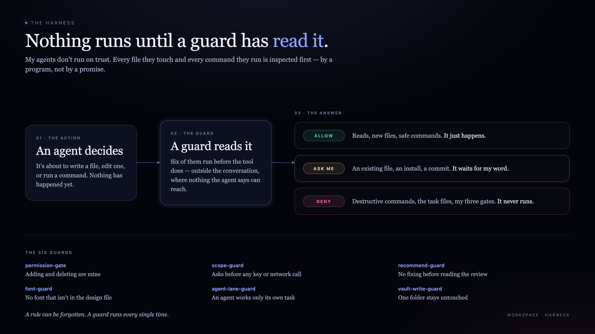
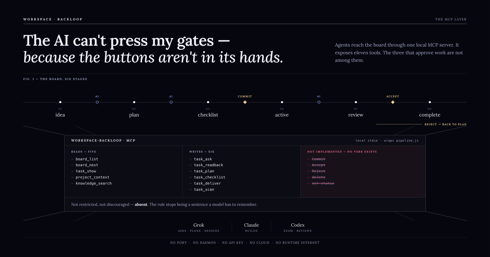
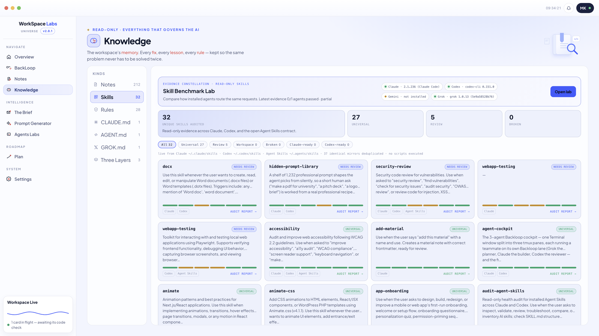

# 🌌 Workspace

**A local-first macOS control room for building software with AI — without surrendering the final decision.**

> A showcase of a private project. Screenshots and design, not source.

---

## The idea

AI agents are fast, confident, and occasionally wrong in ways you only discover later. Workspace exists to keep the speed and take back the last word.

Agents read an idea, ask questions until they actually understand it, write a plan, and do the work. What they never do is decide the work is finished.

**Every gate belongs to a person.**

---

## The board

Work moves through six stages: **idea → plan → checklist → active → review → complete**.

An agent makes exactly three of those moves — drafting the plan, writing the checklist another agent will be tested against, and delivering the finished work for review. The three gates in between are pressed by a human:

- **Commit** — you've read the plan and you're authorising the build
- **Accept** — you've reviewed the result and it lands
- **Reject** — it goes back, with your reason attached

An agent cannot advance its own work. Not by asking nicely, not by editing a file — the tooling refuses.

**Every delivery arrives with proof:** a before-and-after picture and a plain-language note explaining what changed. You review the card, not the codebase.

---

## Three agents, one human gate

Each agent has a fixed job, and no agent may change its own:

- **Grok** — asks the questions, writes the plan, owns the design
- **Codex** — writes the checklist before the build, then reads the code another agent wrote and reports the bugs in plain language
- **Claude** — builds, and tests against a list he didn't write
- **You** — decide

**The checklist is the newest stage.** Before anything is built, the reviewer writes down what has to be true for the work to be finished. The builder then tests against that list — so nobody marks their own homework.

**No agent reviews its own work.** The reviewer exists for a specific reason: the person holding the gate may not read code. So a second agent reads it for them and writes what's wrong in words they can act on. You still press Accept — but you press it informed.

Swapping who builds and who reviews is a human button, and it lasts exactly one task.

The general pattern behind this — roles that can't change, one owner per task, nothing reviewing itself — is written up on its own: **[Separation of duties for AI agents](https://github.com/itsmk91/agent-separation-of-duties)**.

---

## The law

Twenty-four standing rules the agents load at the start of every session. **Each one is written together with the failure that produced it** — the wrong build, the lost afternoon, the thing that nearly shipped.

A few of them:

- **Prove it before you call it done.** Run it, screenshot it, show the output. Not "should work."
- **Study before you guess.** Every fix ever made is searchable. Read it before theorising.
- **Build only what was asked.** An unrequested addition is a defect, not a bonus.
- **Ask until you understand.** The stop condition isn't a question count — it's replaying the task back in your own words and hearing *"yes, that's it."*
- **Design comes first.** The look is decided deliberately, before a line of interface is written.

And the rules aren't advice. **Six guards** sit between the agent and your machine and **refuse**. Each one fails closed — unreadable input is a denial, not a pass. They are the next section.

---

## The guards that run first

Rules written in a document are advice. A model can forget advice.

So the rules that matter most don't live in a document. They live in six small programs that run **before** any tool does. Every time an agent is about to write a file, edit one, or run a command, those programs read the action first and answer one of three things:

| Answer | What it covers |
| --- | --- |
| **Allow** | Reads, new files, safe commands — it just happens |
| **Ask me** | An existing file, an install, a commit — it waits for the human's word |
| **Deny** | Destructive commands, the task files, the three human gates — it never runs |

The six:

| Guard | What it watches |
| --- | --- |
| `permission-gate` | Adding and deleting belong to the human |
| `scope-guard` | Asks before any key, secret or network call is introduced |
| `recommend-guard` | No fixing before the reviewer's findings have been read |
| `font-guard` | No font that isn't in the project's design file |
| `agent-lane-guard` | An agent works only its own task, never another's |
| `vault-write-guard` | One folder stays untouched |

They sit outside the conversation. An agent can't talk one of them into a different answer, because the answer isn't produced by talking — the guard runs before the tool, reads the actual command, and returns allow, ask or deny.

**That is the difference between a rule and a guard. A rule is a sentence that has to be remembered. A guard runs every single time.**

---

## The door the agents come through

The agents never reach the board directly. They reach it through a small local server that hands them a fixed set of tools — MCP, the open protocol most of this space now speaks.

That list is the entire world they can touch. **Eleven tools: five that read the board, six that write to it.**

Commit, Accept and Reject are not on it.

So an agent can plan a task, build it, and hand it back for review — and then it stops. Not because a rule told it to. Because there is no function to call. A rule can be argued with; a missing verb cannot.

It runs as a plain local process on your own machine. No port is opened, no API key exists, nothing leaves the laptop.

**The strongest rule is the one that doesn't need enforcing.**

---

## The memory

Every bug this system has ever hit is written down — not in someone's head, but in a folder the agents are required to read *before* they touch anything.

It holds three kinds of note:

- **A diary.** What broke, what fixed it, which project, what date. Specific, not wise. **176 entries so far.**
- **A textbook.** The lesson *behind* a fix, once it turns out to be bigger than the bug that caused it. Not *"the button was the wrong colour"* but *"a disabled button with custom colours looks enabled and dies silently."* **145 of them.**
- **A map.** How a piece of the machinery actually works, written down so nobody has to re-derive it.

One rule keeps the textbook honest: **every** fix goes in the diary, but only a fix a future agent would hit again — different project, different month — gets promoted to a lesson. One-offs stay one-offs, so the textbook never fills with noise.

### Why it exists

**An agent's memory ends when the session does.** Whatever it works out today, it has forgotten by tomorrow. Without somewhere to put what it learned, every session starts from zero and the same ground gets covered forever.

**The same bugs were being solved twice** — and sometimes solved *differently* the second time, so the new fix quietly undid the old one. A fix costs an hour once. Re-guessing it costs an hour every time it comes back.

**Writing it down is only half of it.** The other half is a search that runs *before* anyone theorises about a cause. Record without recall is a diary nobody reads.

**And it compounds.** The rules in this system weren't designed in the abstract. The guards, the agent lanes, the scope check — each one exists because the diary showed the same shape of mistake twice. Every rule was a scar somebody wrote down first.

176 things went wrong in four weeks. That isn't a failure record. It's **176 traps that are now mapped**, and the next agent walks past all of them.

### The problems didn't just make rules — they made tools

Some of the agents' own skills exist only because something went wrong first. Each of these was written here, for this system, after a specific failure:

- **A skills auditor.** Two skills quietly ended up competing for the same job. Because agents pick a skill by reading its description, two overlapping descriptions make the choice unpredictable — so it didn't present as a duplicate, it presented as a *random bug*. Whole work sessions went into unpicking it. The answer was a read-only auditor that checks every installed skill for duplicate names, clashing triggers, broken structure and safety signals, so a clash surfaces the same day instead of three weeks later as a mystery.

- **A repair workflow.** Once the auditor started finding things, it turned out the ecosystem was full of tools that *diagnose* a broken skill and none that safely *fix* one. So one got built: back up first, apply the smallest change that works, re-audit, and show before-and-after proof.

- **A front-door guard.** One briefing was rejected five times in a row. Every rejection traced back to the same root cause — a question nobody asked before building. So the asking became a tool: clarifying questions, click-to-answer, before a plan exists, ending with the task replayed back in the person's own words for a yes.

- **A peer reviewer.** *"I'm not a developer — even if I read the code I won't understand it."* That sentence became a skill: a second agent reads the code the first one wrote and reports the bugs in plain language, on the card, before anything is approved.

The pattern is the whole point. A bug gets fixed, then written down. If it keeps happening, it becomes a rule. If the rule needs enforcing, it becomes a guard. And if the work itself keeps repeating, **it becomes a tool** — so nobody has to remember to do it right.

---

## The toolbox, audited

Thirty-four agent skills, continuously audited across Claude, Codex and the open Agent Skills contract — checked for structure, portability, trigger conflicts and safety signals. Read-only: nothing is executed to inspect it.

The system checks its own tools, and reports what it finds. It checks the projects the same way — the real code behind each one, read before an agent is allowed to change it.

The pattern behind both — evidence with a location, a labelled confidence, and a checker that is never allowed to fix what it found — is written up on its own, and **both checkers are there to take**: **[Health checks for AI agents](https://github.com/itsmk91/agent-health-checks)** — two dependency-free Node scripts, MIT licensed.

---

## What it's built on

Electron · Node · macOS. Offline by default — it reads your projects live from disk and never copies your code anywhere.

---

Source kept private. · [LinkedIn](https://www.linkedin.com/in/mohammad-aljaziri-940750105/)
